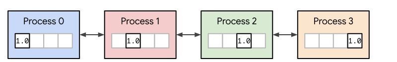
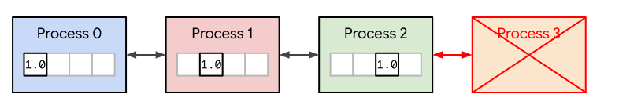
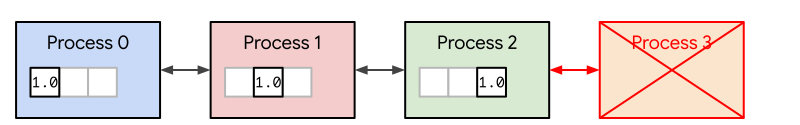

# Fault Tolerant Distributed JAX

[Multi-controller JAX][mcjax] lets you distribute a JAX program across multiple
machines. This is useful if, for example, you're training a model that is too
big to fit on a single machine. By default, multi-controller JAX is *not* fault
tolerant. If any machine fails, the others fail as well. In this blog post, we
introduce some experimental fault tolerance features that were recently added
to multi-controller JAX.

<!-- more -->

For more details, please refer to the [full documentation][docs].

## Multi-Controller JAX

With multi-controller JAX, you *write* a single JAX program and then *run* the
program multiple times across multiple machines. Each running instance of the
program is called a **process**. Arrays can be [sharded][sharding] across the
processes, and processes can communicate with each other to perform distributed
operations (e.g., a `jnp.sum` of a sharded array).

Consider the following multi-controller JAX program, `not_fault_tolerant.py`,
as an example. The program shards an array of ones across all processes. The
processes then repeatedly perform a `jnp.sum` to sum up the array.

```python title="not_fault_tolerant.py"
from absl import app
from collections.abc import Sequence
import jax
import jax.numpy as jnp
import time

def main(args: Sequence[str]) -> None:
  # Parse process_id and num_processes from the command line arguments.
  process_id = int(args[1])
  num_processes = int(args[2])

  # Initialize multi-controller JAX. See
  # https://docs.jax.dev/en/latest/multi_process.html for details.
  jax.distributed.initialize(
      coordinator_address="localhost:9000",
      num_processes=num_processes,
      process_id=process_id,
      local_device_ids=[process_id],
      heartbeat_timeout_seconds=10,
  )

  # Shard an array x across all processes.
  n, i = num_processes, process_id
  mesh = jax.make_mesh((n,), ("i",), axis_types=(jax.sharding.AxisType.Explicit,))
  jax.set_mesh(mesh)
  x = jax.reshard(jnp.ones(n), jax.P("i"))

  # Repeatedly perform an all-reduce (jnp.sum) every second.
  while True:
    print(jnp.sum(x))
    time.sleep(1)

if __name__ == "__main__":
  app.run(main)
```

We could run this program multiple times across multiple machines, but to keep
things simple, let's run it four times on a single machine with four GPUs. Each
process will use one GPU.

```console
$ python not_fault_tolerant.py 0 4 # In terminal 1.
$ python not_fault_tolerant.py 1 4 # In terminal 2.
$ python not_fault_tolerant.py 2 4 # In terminal 3.
$ python not_fault_tolerant.py 3 4 # In terminal 4.
```

When you run the commands above, each process will repeatedly print out `4.0`
(the result of calling `jnp.sum(x)`) every second. The processes look like
this:



## Fault Intolerant By Default

By default, multi-controller JAX is intentionally *not* fault tolerant. If any
process fails during the execution of a program, then all other processes will
also fail. For example, if process 3 fails:



Then all other processes will also fail:


You can observe this behavior by running the `not_fault_tolerant.py` program as
described above and then killing process 3 with the following command:

```console
$ pkill -9 -f 'python not_fault_tolerant.py 3 4'
```

After you kill process 3, there will be a short delay, and then all other
processes will also crash.

## Fault Tolerance and Live Devices

We recently added some experimental features to multi-controller JAX that let
you make your multi-controller JAX programs fault-tolerant. These features are
highlighted in the `fault_tolerant.py` script below, which is a modification of
the `not_fault_tolerant.py` script above.

As before, an array of ones is sharded across a set of processes, and the
processes repeatedly perform a `jnp.sum`. The key difference is that now when a
process fails, the remaining processes continue running. The live processes
reshard the array to ignore the failed process and continue executing
`jnp.sum` every second.

Here's the program. Explanation follows.

```python title="fault_tolerant.py"
# Set some flags needed for fault tolerance.
import os
os.environ['XLA_FLAGS'] = ' '.join([
  '--xla_gpu_nccl_terminate_on_error=false',
  '--xla_gpu_nccl_async_execution=true',
  '--xla_gpu_nccl_blocking_communicators=false',
])
os.environ['XLA_PYTHON_CLIENT_ABORT_COLLECTIVES_ON_FAILURE'] = '1'
os.environ['XLA_PYTHON_CLIENT_USE_TFRT_GPU_CLIENT'] = '1'

from absl import app
from collections.abc import Sequence
from jax.experimental.multihost_utils import live_devices
import jax
import jax.numpy as jnp
import time

def main(args: Sequence[str]) -> None:
  # Parse process_id and num_processes from the command line arguments.
  process_id = int(args[1])
  num_processes = int(args[2])

  # Set some configuration options needed for fault tolerance.
  jax.config.update("jax_enable_recoverability", True)

  # Initialize multi-controller JAX.
  jax.distributed.initialize(
      coordinator_address="localhost:9000",
      num_processes=num_processes,
      process_id=process_id,
      local_device_ids=[process_id],
      heartbeat_timeout_seconds=10,
  )

  while True:
    try:
      # Figure out which devices are alive. See below for explanation.
      with live_devices(jax.devices()) as devices:
        # Shard an array x across these live devices.
        n, i = len(devices), process_id
        axis_types = (jax.sharding.AxisType.Explicit,)
        mesh = jax.make_mesh((n,), ("i",), devices=devices, axis_types=axis_types)
        jax.set_mesh(mesh)
        x = jax.reshard(jnp.ones(n), jax.P("i"))

        # Perform an all-reduce via jnp.sum.
        print(jnp.sum(x))
    except Exception as e:
      # If any process failed during the execution of the jnp.sum, an exception
      # will be raised on all other processes.
      print('FAIL:', e)

    time.sleep(1)

if __name__ == "__main__":
  app.run(main)
```

We made two major code changes to the script above to implement fault
tolerance. The first, which is uninteresting, is the setting of various flags
and configuration options. As multi-controller JAX's fault tolerance features
mature, these flags will be simplified.

The second, which is interesting, is the use of a `try...except` block wrapping
a call to `live_devices`. The `try...except` block catches any exceptions that
arise due to a process failure. `live_devices` is a new API that returns the
current set of live devices. The `fault_tolerant.py` program uses
`try...except` and `live_devices` together to detect a process failure, to
reshard the array `x` across the remaining healthy machines, and to continue
running.

Run the script as before:

```console
$ python fault_tolerant.py 0 4 # In terminal 1.
$ python fault_tolerant.py 1 4 # In terminal 2.
$ python fault_tolerant.py 2 4 # In terminal 3.
$ python fault_tolerant.py 3 4 # In terminal 4.
```

The processes will repeatedly print out `4.0`. Then, kill process 3:

```console
$ pkill -9 -f 'python fault_tolerant.py 3 4'
```

Process 0, process 1, and process 2 will continue running. They will ignore the
failed process 3 and start printing `3.0` instead of `4.0`.



If you re-run process 3, it will automatically re-join the other processes and
be reported healthy by `live_devices`:

```console
$ python fault_tolerant.py 3 4 # In terminal 4.
```

All four processes will start printing `4.0` again.

## Conclusion

Using a combination of `try..except` and `live_devices`, you can now make your
multi-controller JAX programs fault-tolerant. Please refer to the [full
documentation][docs] for more information and examples.

[docs]: https://docs.jax.dev/en/latest/fault_tolerance.html
[mcjax]: https://docs.jax.dev/en/latest/multi_process.html
[sharding]: https://docs.jax.dev/en/latest/notebooks/Distributed_arrays_and_automatic_parallelization.html
